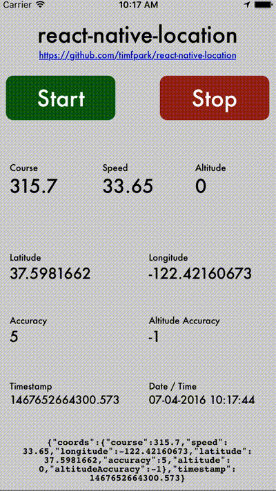

# `react-native-location`

   [](https://circleci.com/gh/timfpark/workflows/react-native-location/tree/master)

Native GPS location support for React Native. You might decide to use this library over the [built-in geolocation](https://facebook.github.io/react-native/docs/geolocation.html) because it includes some additional features:

* Allows you choose what type of permission to ask for ("when in use" or "always"). The built-in geolocation library will look at your plist file and choose "always" if you have the `NSLocationAlwaysUsageDescription` property, however, you might have a usecase where you want to start by asking the user for "while in use" permission and later upgrade the permission to "always" when they turn on a feature which requires background location.
* Ability to check the current permission status (`RNLocation.getCurrentPermission`).
* Allows you to monitor the device heading.

## Installation
Install the library using either Yarn:

```
yarn add react-native-location
```

or using npm:

```
npm install --save react-native-location
```

You then need to link the native parts of the library for the platforms you are using. Click on the arrow to show the steps for each platform.

<details>
<summary><strong>iOS Installation Instructions</strong></summary>

### 1a. Automatically link with the CLI tool
The easiest way to link the library is using the CLI tool by running this command from the root of your project:

```
react-native link react-native-location
```

### 1b. Install with Cocoapods
You can also link the library using Cocoapods by adding this line to your `Podfile`:

```ruby
pod 'react-native-location', :path => '../node_modules/react-native-location/react-native-location.podspec'
```

### 1c. Or manually link the library
If you can't or don't want to use the CLI tool, you can also manually link the library using the [intructions in the React NAtive documentation](https://facebook.github.io/react-native/docs/linking-libraries-ios#manual-linking).

### 2. Ensure you have the CoreLocation library linked
*This is not required if you have installed using Cocoapods.*

You then need to make sure you have the iOS CoreLocation library linked to your project.

To do this, click on the your project in XCode (the name of your project at the top of the left panel), select your apps build target, go to the `Build Phases` tab then in the `Link Binary With Libraries` section add `CoreLocation.framework`.

### 3. Info.plist usage descriptions
Finally, you then need to make sure you have the correct usage discriptions inside your `Info.plist` file. The message will show in the Alert box when your app requests permissions and lets the user know why you are asking for that permissions. They are also part of the App Store review process.

If you are only requesting "when in use" (foreground) location access you just need to make sure you have the `NSLocationWhenInUseUsageDescription` item in your Plist.

If you are requesting "always" (background) permission you will *also* need to add `NSLocationAlwaysAndWhenInUseUsageDescription` and `NSLocationAlwaysUsageDescription` into your PList file.

The easiest way to add these is to find your `Info.plist` in Xcode, right click on it, and then choose "edit as source code". You can then enter the items you need into the file:

```xml
<key>NSLocationWhenInUseUsageDescription</key>
<string>This is the plist item for NSLocationWhenInUseUsageDescription</string>
<key>NSLocationAlwaysAndWhenInUseUsageDescription</key>
<string>This is the plist item for NSLocationAlwaysAndWhenInUseUsageDescription</string>
<key>NSLocationAlwaysUsageDescription</key>
<string>This is the plist item for NSLocationAlwaysUsageDescription</string>
```

### 4. Background mode setup (optional)
For background location to work, a few things need to be configured:

1. In the Xcode project, go to Capabilities, switch on "Background Modes" and check "Location updates".
2. Set `NSLocationAlwaysAndWhenInUseUsageDescription` and `NSLocationAlwaysUsageDescription` in your `Info.plist` file.
3. For iOS 9+, set [`allowsBackgroundLocationUpdates`](https://developer.apple.com/reference/corelocation/cllocationmanager/1620568-allowsbackgroundlocationupdates) to true when configuring the library in your Javascript code. Like this:

```javascript
RNLocation.configure({ allowsBackgroundLocationUpdates: true });
```

</details>

<details>
<summary><strong>Android Installation Instructions</strong></summary>

### 1a. Automatically link the library using the CLI tool
The easiest way to link the library is using the CLI tool by running this command from the root of your project:

```
react-native link react-native-location
```

### 1b. Manually link the library
If you can't or don't want to use the CLI tool, you can manually link the library by making the following changes (click on the arrow to show the steps):

<details>
<summary><strong>Steps to manually link the library</strong></summary>
   
#### `android/settings.gradle`
```groovy
include ':react-native-location'
project(':react-native-location').projectDir = new File(rootProject.projectDir, '../node_modules/react-native-location/android')
```

#### `android/app/build.gradle`
```groovy
dependencies {
   ...
   implementation project(':react-native-location')
}
```

#### `android/app/src/main/.../MainApplication.java`
On top, where imports are:

```java
import com.github.reactnativecommunity.location.RNLocationPackage;
```

Add the `RNLocationPackage` class to your list of exported packages.

```java
@Override
protected List<ReactPackage> getPackages() {
    return Arrays.asList(
            new MainReactPackage(),
            new RNLocationPackage()
    );
}
```
</details>

### 2. Android manifest permissions
You need to ensure that your `AndroidManifest.xml` contains this line:

```xml
<uses-permission android:name="android.permission.ACCESS_COARSE_LOCATION"/>
```

If you want to access fine location then you should also include:

```xml
<uses-permission android:name="android.permission.ACCESS_FINE_LOCATION"/>
```

### 3. Install the Google Fused Location provider dependency (optional)
The library provides two methods of getting the location on Android. The default is the builtin location manager, however, you can optionally choose to install the Fused Location library which provides more accurate and faster results. The downside is that it will only work on devices with Google Play Services installed and configured (which is most Android devices in the west, but not Kindle devices or Asian markets).

If you would like to use the Google Play Services Fused Location provider, then you need to add these dependencies to your `android/app/build.gradle` file:

```groovy
implementation "com.google.android.gms:play-services-base:16.0.1"
implementation "com.google.android.gms:play-services-location:16.0.0"
```
</details>

## Example application
In the [example](https://github.com/timfpark/react-native-location/example) folder is a React Native sample app which you can use as a sample implementation to start from.

The app requests permissions, takes reading every 5 distance and starts immediately. To use in the iOS simulator, look on the `Debug -> Location` menu for sample trips that will show you updating location such as City Bycicle Ride, City Run, and Freeway Drive.



## Usage
```javascript
import RNLocation from 'react-native-location';

RNLocation.configure({
  distanceFilter: 5.0
})

RNLocation.requestPermission({
  ios: "whenInUse",
  android: {
    detail: "coarse"
  }
}).then(granted => {
    if (granted) {
      this.locationSubscription = RNLocation.subscribeToLocationUpdates(locations => {
        /* Example location returned
        {
          speed: -1,
          longitude: -0.1337,
          latitude: 51.50998,
          accuracy: 5,
          heading: -1,
          altitude: 0,
          altitudeAccuracy: -1
          floor: 0
          timestamp: 1446007304457.029,
          fromMockProvider: false
        }
        */
      })
    }
  })
```

## Methods
To access the methods, you need import the `react-native-location` module. This is done through `import RNLocation from 'react-native-location'`.

### Configuration
#### `RNLocation.configure`
This is used to configure the location provider. You can use this to enable background mode, filter location updates to a certain distance change, and ensure you have the power settings set correctly for your use case.

You can call `configure` multiple times at it will only change the setting which you pass to it. For example if you only want to change `activityType`, you can call `configure` with just that property present.

```javascript
RNLocation.configure({
    distanceFilter: 100, // Meters
    desiredAccuracy: {
      ios: "best",
      android: "balancedPowerAccuracy"
    },
    // Android only
    androidProvider: "auto",
    interval: 5000, // Milliseconds
    fastestInterval: 10000, // Milliseconds
    maxWaitTime: 5000, // Milliseconds
    // iOS Only
    activityType: "other",
    allowsBackgroundLocationUpdates: false,
    headingFilter: 1, // Degrees
    headingOrientation: "portrait",
    pausesLocationUpdatesAutomatically: false,
    showsBackgroundLocationIndicator: false,
})
```

There are the valid configuration options and what they do:

<table>
   <tr>
      <th>Option</th>
      <th>Platforms</th>
      <th>Description</th>
      <th>Values</th>
      <th>Documentation</th>
   </tr>
   
   <tr>
      <td><code>distanceFilter</code></td>
      <td>
         Android
         iOS
      </td>
      <td>The minimum distance in meters that the device location needs to change before the location update callback in your app is called. Defaults to <code>0</code> for no filtering.</td>
      <td><code>number</code></td>
      <td>
        <a href="https://developers.google.com/android/reference/com/google/android/gms/location/LocationRequest.html#setSmallestDisplacement(float)">Android Docs</a>
        <a href="https://developer.apple.com/documentation/corelocation/cllocationmanager/1423500-distancefilter">Apple Docs</a>
      </td>
   </tr>

   <tr>
      <td><code>desiredAccuracy</code></td>
      <td>
         Android
         iOS
      </td>
      <td>
        <p>The accuracy of the location data. Defaults to <code>best</code> on iOS and <code>balancedPowerAccuracy</code> on Android.</p>
        <p>Valid options for <code>android</code>: <code>balancedPowerAccuracy</code>, <code>highAccuracy</code>, <code>lowPower</code>, or <code>noPower</code>.</p>
        <p>Valid options for <code>ios</code>: <code>bestForNavigation</code>, <code>best</code>, <code>nearestTenMeters</code>, <code>hundredMeters</code>, or <code>threeKilometers</code>.</p>
      </td>
      <td>
        <code>{ android: string, ios: string }</code>
      </td>
      <td>
        <a href="https://developers.google.com/android/reference/com/google/android/gms/location/LocationRequest#setPriority(int)">Android Docs</a>
        <a href="https://developer.apple.com/documentation/corelocation/cllocationaccuracy?language=objc">Apple Docs</a>
      </td>
   </tr>

   <tr>
      <td><code>androidProvider</code></td>
      <td>Android</td>
      <td>The provider which is used on Android to get the location. Your app must include the Google Play services dependencies to use the <code>playServices</code> location provider. By default it will choose the <code>playServices</code> location provider if it detects that the dependencies are installed, otherwise, it will use the <code>standard</code> Android version which does not require Google Play Services to be installed. Note that <code>auto</code> only checks that the dependencies are installed, not that the user has the Google Play services APK installed and set up correctly.</td>
      <td><code>"auto"</code>, <code>"playServices"</code>, or <code>"standard"</code></td>
      <td></td>
   </tr>

   <tr>
      <td><code>interval</code></td>
      <td>Android</td>
      <td>
        <p>Set the desired interval for active location updates, in milliseconds.</p>
        <p>The location client will actively try to obtain location updates for your application at this interval, so it has a direct influence on the amount of power used by your application. Choose your interval wisely.</p>
        <p>This interval is inexact. You may not receive updates at all (if no location sources are available), or you may receive them slower than requested. You may also receive them faster than requested (if other applications are requesting location at a faster interval).</p>
      </td>
      <td><code>number</code></td>
      <td><a href="https://developers.google.com/android/reference/com/google/android/gms/location/LocationRequest#setInterval(int)">Android Docs</a></td>
   </tr>

   <tr>
      <td><code>fastestInterval</code></td>
      <td>Android</td>
      <td>
        <p>Explicitly set the fastest interval for location updates, in milliseconds.</p>
        <p>This controls the fastest rate at which your application will receive location updates, which might be faster than `interval` in some situations (for example, if other applications are triggering location updates).</p>
        <p>This allows your application to passively acquire locations at a rate faster than it actively acquires locations, saving power.</p>
        <p>By default this is 6x the `interval`.</p>
      </td>
      <td><code>number</code></td>
      <td><a href="https://developers.google.com/android/reference/com/google/android/gms/location/LocationRequest#setFastestInterval(int)">Android Docs</a></td>
   </tr>
   
   <tr>
      <td><code>maxWaitTime</code></td>
      <td>Android</td>
      <td>
        <p>Sets the maximum wait time in milliseconds for location updates.</p>
        <p>If you pass a value at least 2x larger than the interval specified with setInterval(long), then location delivery may be delayed and multiple locations can be delivered at once.</p>
      </td>
      <td><code>number</code></td>
      <td><a href="https://developers.google.com/android/reference/com/google/android/gms/location/LocationRequest#setMaxWaitTime(int)">Android Docs</a></td>
   </tr>

   <tr>
      <td><code>allowsBackgroundLocationUpdates</code></td>
      <td>iOS</td>
      <td>A Boolean value indicating whether the app should receive location updates when suspended. Requires permissions to always access the users location. Defaults to <code>false</code>.</td>
      <td><code>boolean</code></td>
      <td><a href="https://developer.apple.com/documentation/corelocation/cllocationmanager/1620568-allowsbackgroundlocationupdates">Apple Docs</a></td>
   </tr>

   <tr>
      <td><code>activityType</code></td>
      <td>iOS</td>
      <td>The type of user activity associated with the location updates. Defaults to <code>other</code>.</td>
      <td><code>"other"</code>, <code>"automotiveNavigation"</code>, <code>"fitness"</code>, <code>"otherNavigation"</code>, or <code>"airborne"</code></td>
      <td><a href="https://developer.apple.com/documentation/corelocation/cllocationmanager/1620567-activitytype">Apple Docs</a></td>
   </tr>

   <tr>
      <td><code>headingFilter</code></td>
      <td>iOS</td>
      <td>The minimum angle in degrees that the device heading needs to change before the heading update callback in your app is called. Defaults to <code>0</code> for no filtering.</td>
      <td><code>number</code></td>
      <td></td>
   </tr>

   <tr>
      <td><code>headingOrientation</code></td>
      <td>iOS</td>
      <td>The device orientation to use when computing heading values. Defaults to <code>portrait</code>.</td>
      <td><code>"portrait"</code>, <code>"portraitUpsideDown"</code>, <code>"landscapeLeft"</code>, or <code>"landscapeRight"</code></td>
      <td><a href="https://developer.apple.com/documentation/corelocation/cllocationmanager/1620556-headingorientation">Apple Docs</a></td>
   </tr>

   <tr>
      <td><code>pausesLocationUpdatesAutomatically</code></td>
      <td>iOS</td>
      <td>A Boolean value indicating whether the location manager object may pause location updates. Defaults to <code>true</code>.</td>
      <td><code>boolean</code></td>
      <td><a href="https://developer.apple.com/documentation/corelocation/cllocationmanager/1620553-pauseslocationupdatesautomatical">Apple Docs</a></td>
   </tr>

   <tr>
      <td><code>showsBackgroundLocationIndicator</code></td>
      <td>iOS</td>
      <td>A Boolean indicating whether the status bar changes its appearance when location services are used in the background. Defaults to <code>false</code>. Only works on iOS 11+ and is ignored for earlier versions of iOS.</td>
      <td><code>boolean</code></td>
      <td><a href="https://developer.apple.com/documentation/corelocation/cllocationmanager/2923541-showsbackgroundlocationindicator">Apple Docs</a></td>
   </tr>
</table>

### Permissions
Correctly managing permissions is key to working with the users location in mobile apps.

* Ask for the lowest level of permissions you can. You'll almost always only need `whenInUse` (foreground) permission rather than background.
* On iOS you only get one chance to ask for permission. If the user requests it the first time this method will always resolves to `false`.
* If you ask for `always` permission then the user gets the chance to accept, but only give you `whenInUse` permission. The Promise will still resolve to `false`, however, if you call `RNLocation.getCurrentPermission` you can check if they actually accepted the lesser permission.
* You should monitor the permissions and respond to it correctly. The user is able to go to their phone setting and revoke or downgrade permissions at any time.

#### `RNLocation.requestPermission`
This method should be called before subscribing to location updates. You need to pass in the type of permission you want for each platform. You can choose not to ignore a platform and it will be ignored. The method returns a promise which resolves to `true` if the permission was granted and `false` if not. For Android you can optionally provide a `rationale` which will be displayed if you ask the user for permission a 2nd time after they have denied permission once.

```javascript
RNLocation.requestPermission({
  ios: 'whenInUse', // or 'always'
  android: {
    detail: 'coarse', // or 'fine'
    rationale: {
      title: "We need to access your location",
      message: "We use your location to show where you are on the map",
      buttonPositive: "OK",
      buttonNegative: "Cancel"
    }
  }
});
```

#### `RNLocation.checkPermission`
Checks if the currently granted permissions match the given options. You can call this before `requestPermission` to check if you already have the permission level you would like. This is especially useful if you want to display a message to the user about not having the correct permissions before actually requesting them.

```javascript
RNLocation.checkPermission({
  ios: 'whenInUse', // or 'always'
  android: {
    detail: 'coarse' // or 'fine'
  }
});
```

#### `RNLocation.getCurrentPermission`
Gets the current permission status. Note that the values will be different on Android and iOS as the permission systems are different. It's usually best to use `RNLocation.checkPermission` instead of checking the permission status yourself to avoid re-implementing the logic.

```javascript
RNLocation.getCurrentPermission()
  .then(currentPermission => {
    ...
  })
```

#### `RNLocation.subscribeToPermissionUpdates`
Monitor the permission status for changes.

```javascript
// Subscribe
const unsubscribe = RNLocation.subscribeToPermissionUpdates(currentPermission => {
  ...
})

// Unsubscribe
unsubscribe();
```

### `RNLocation.subscribeToLocationUpdates`
Subscribe to location changes with the given listener. Ensure you have the correct permission before calling this method. The location provider will respect the settings you have given it. Each event may return an array with more than one location. This is because the OS might batch location updates together and deliver them all at once. Take a look at the `timestamp` to find the latest.

```javascript
// Subscribe
const unsubscribe = RNLocation.subscribeToLocationUpdates(locations => {
  ...
})

// Unsubscribe
unsubscribe();
```

### `RNLocation.getLatestLocation`
Get the latest location. Ensure you have the correct permission before calling this method.

This will subscribe to location events for you at the unsubscribe when it gets its first valid location. Usually, this method will return very fast with a possibly out of date location, however, in some circumstances it will not return a location. Therefore, this method has a timeout after which the promise will be resovled with `null` value.

The location provider will respect the settings you have given it, so if you need a location with a certain accuracy, ensure you call `RNLocation.configure` first. If you want *any* location then ensure you call `RNLocation.configure` with no distance filter.

```javascript
RNLocation.configure({ distanceFilter: null });
RNLocation.getLatestLocation({ timeout: 60000 })
  .then(latestLocation => {
    // Use the location here
  })
```

### `RNLocation.subscribeToSignificantLocationUpdates` (iOS only)
Subscribe to significant updates to the users location with the given listener. *This method does not take into account the `distanceFilter` which you configured RNLocation with.* In most cases, you should call `RNLocation.configure` with the correct settings and then use `RNLocation.subscribeToLocationUpdates` to subscribe to the location updates. This will allow you to support both Android and iOS with the same code. For more details, take a look at [Apple's documentation](https://developer.apple.com/documentation/corelocation/cllocationmanager/1423531-startmonitoringsignificantlocati?language=objc). 

```javascript
// Subscribe
const unsubscribe = RNLocation.subscribeToSignificantLocationUpdates(locations => {
  ...
})

// Unsubscribe
unsubscribe();
```

### `RNLocation.subscribeToHeadingUpdates` (iOS only)
Subscribe to heading changes with the given listener. Ensure you have the correct permission before calling this method. The location provider will respect the settings you have given it.

```javascript
// Subscribe
const unsubscribe = RNLocation.subscribeToHeadingUpdates(heading => {
  ...
})

// Unsubscribe
unsubscribe();
```

## License
The library is released under the MIT licence. For more information see `LICENSE`.
